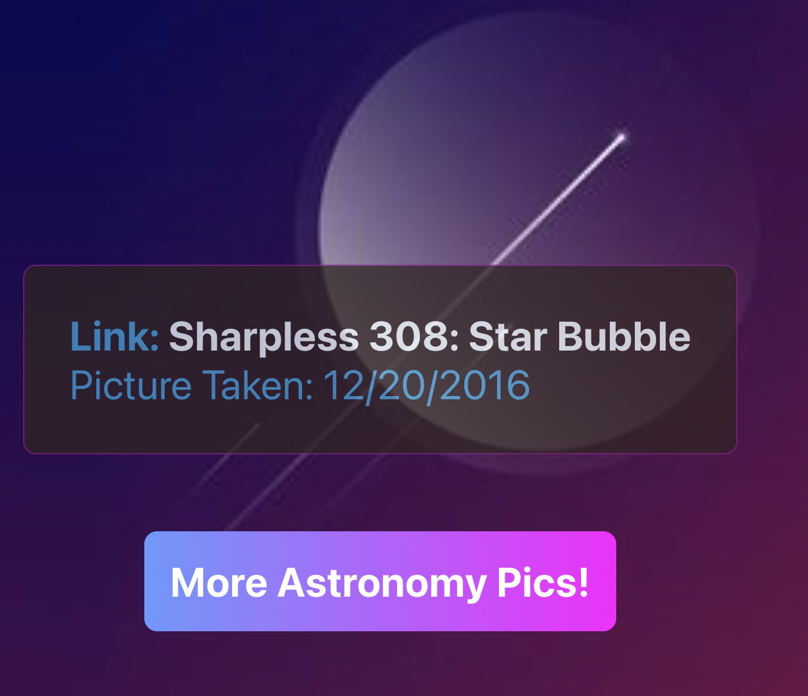

## Astronomy Picture of the Day 

A website that serves random pictures from the official Astronomy Picture of the Day RESTful api and built in ReactJS. The user will get the title and date of the image with a link to the full site. 

____
#### Preview

### Built With
* [ReactJS](https://reactjs.org/) - Framework
* [JavaScript](https://developer.mozilla.org/en-US/docs/Web/JavaScript) - Primary Language
* [CSS](https://developer.mozilla.org/en-US/docs/Web/CSS) - Primary Language

##### Author - @forextroll [github]